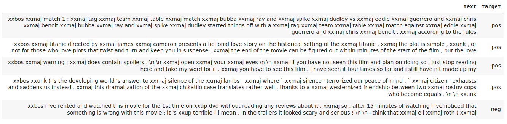
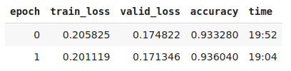

# imdb_classifier

Model performed with __fastai__ library (v1).

The [dataset](http://ai.stanford.edu/~amaas/data/sentiment/) has been curated by Andrew Maas et al. and contains a total of 100,000 reviews on IMDB. 25,000 of them are labelled as positive and negative for training, another 25,000 are labelled for testing (in both cases they are highly polarized). The remaning 50,000 is an additional unlabelled data.

- Results: With resnet34 as the architecture chosen, our model got an accuracy of __93.6%.__

